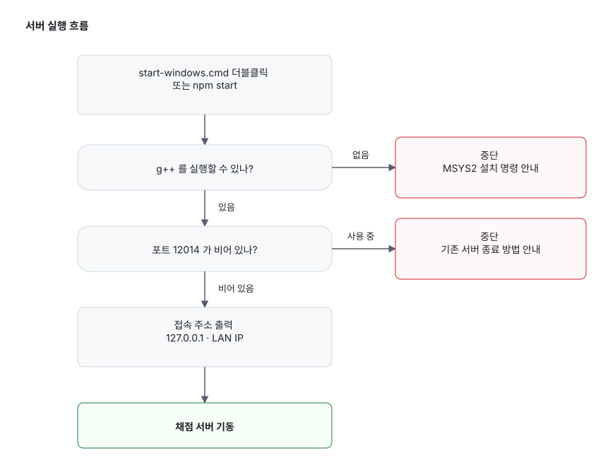
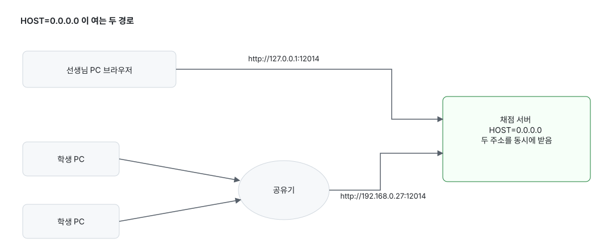
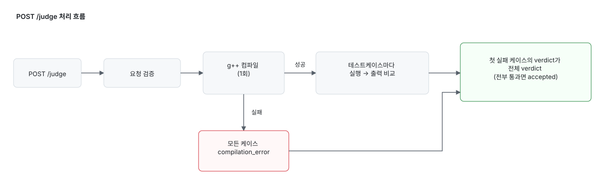

# 코딩살구클럽 전용 로컬 채점 서버

로컬 C++ 채점 서버. 요청 본문에 소스코드와 테스트케이스를 담아 보내는 JSON HTTP API입니다.
필요한 건 **Node.js 18+** 와 **`g++`** 둘뿐이고, 외부 npm 의존성은 없습니다.

## Windows 빠른 실행

1. [Node.js 18+](https://nodejs.org) 설치
2. MSYS2의 `g++` 설치 → [g++ 설치](#g-설치msys2)
3. 프로젝트 폴더의 **`start-windows.cmd` 더블클릭** (터미널이면 `npm start`)

`JUDGE_CXX`, `JUDGE_COMPILE_TIMEOUT_MS`, `HOST`, `PORT` 를 미리 설정할 필요는 없습니다. `scripts/start.js` 가 대신 확인하고, 문제가 있으면 서버를 켜기 전에 멈춥니다.

<picture>
  <source media="(prefers-color-scheme: dark)" srcset="docs/diagrams/start-flow-dark.svg">
  
</picture>

컴파일러가 없는 채로 서버가 뜨면 **모든 제출이 CE로 채점되기 때문에**, 조용히 켜지는 대신 멈추고 설치 방법을 알려 줍니다.

정상적으로 뜨면 이런 화면입니다.

```text
코딩살구클럽 채점 서버를 시작합니다.
  Node.js  v20.11.1 (win32)
  컴파일러 C:\msys64\ucrt64\bin\g++.exe
           g++.exe (Rev3, Built by MSYS2 project) 14.2.0

  접속 주소
    이 PC        http://127.0.0.1:12014
    같은 네트워크  http://192.168.0.27:12014
    헬스체크      http://127.0.0.1:12014/health

  종료하려면 Ctrl+C
```

`같은 네트워크` 주소가 학생 PC에서 채점 서버로 지정할 주소입니다. 첫 실행 때 Windows 방화벽 창이 뜨면 **개인 네트워크 허용**에 체크해야 다른 PC에서 접속됩니다.

### HOST를 내 IP로 바꿔야 하나요?

아니요, 그대로 두세요. 기본값 `0.0.0.0` 은 "이 PC의 모든 네트워크 주소로 받는다"는 뜻이라 로컬 주소와 LAN 주소가 **동시에** 열립니다. 특정 IP를 지정하면 오히려 그 주소 하나로 좁아집니다.

<picture>
  <source media="(prefers-color-scheme: dark)" srcset="docs/diagrams/network-dark.svg">
  
</picture>

### g++ 설치(MSYS2)

Windows에서 C++ 제출을 채점하려면 `g++` 가 필수입니다. 없는 채로 서버가 켜지면 채점 결과의 컴파일 출력이 전부 `C++ compiler not found: g++` 가 됩니다. 제출 코드 문제가 아니라 **채점 서버 PC에 컴파일러가 없다**는 뜻입니다.

1. [MSYS2](https://www.msys2.org/)를 **기본 경로(`C:\msys64`)** 에 설치
2. 시작 메뉴에서 `MSYS2 UCRT64` 터미널 열기
3. 아래 명령 실행

```bash
pacman -Syu
pacman -S --needed mingw-w64-ucrt-x86_64-gcc
```

`pacman -Syu` 도중 터미널을 닫고 다시 열라는 안내가 나오면, `MSYS2 UCRT64` 를 다시 열고 이어서 실행합니다. 끝나면 `start-windows.cmd` 를 다시 실행하세요.

`where g++` 가 실패해도 상관없습니다. 서버는 Windows 사용자 PATH가 아니라 자체 탐색 목록으로 컴파일러를 찾고, `g++` 가 필요로 하는 DLL 경로도 컴파일 프로세스에 자동으로 붙여 줍니다. MSYS2를 **다른 경로**에 설치했을 때만 `JUDGE_CXX` 로 전체 경로를 지정합니다.

```powershell
$env:JUDGE_CXX="D:\tools\msys64\ucrt64\bin\g++.exe"
npm start
```

### 정상 동작 확인

```powershell
Invoke-RestMethod http://127.0.0.1:12014/health    # 서버가 살아 있는지

$env:JUDGE_URL="http://127.0.0.1:12014"
npm run smoke                                      # 컴파일·채점까지 한 번에
```

smoke가 `PASS CORS`, `PASS AC`, `PASS WA`, `PASS CE`, `PASS TLE` 를 출력하면 정상입니다.

### 문제가 생겼을 때

| 증상 | 해결 |
| --- | --- |
| 컴파일러를 찾지 못했다고 멈춤 | 위 [g++ 설치](#g-설치msys2) 후 재실행 |
| 포트가 사용 중이라고 멈춤 | 안내대로 기존 서버 종료, 또는 `$env:PORT="12015"` |
| 학생 PC에서 접속이 안 됨 | 방화벽에서 Node.js의 개인 네트워크 접근 허용, 같은 공유기인지 확인 |
| 설정을 바꿨는데 반영 안 됨 | 서버는 시작 시점의 환경변수를 씁니다. Ctrl+C 후 재실행 |

실행 중인 서버를 직접 찾아 끄려면:

```powershell
Get-NetTCPConnection -LocalPort 12014 -State Listen | Select-Object OwningProcess
Stop-Process -Id <OwningProcess>
```

### 선택 환경변수

기본값으로 충분합니다. 아래는 특수한 상황에서만 씁니다.

| 변수 | 기본값 | 설명 |
| --- | --- | --- |
| `PORT` | `12014` | 리슨 포트 |
| `HOST` | `0.0.0.0` | 리슨 주소. 모든 인터페이스 |
| `JUDGE_CXX` | 자동 탐색 | 표준 경로가 아닌 곳에 g++ 를 설치한 경우에만 |
| `JUDGE_COMPILE_TIMEOUT_MS` | Windows 30초 | **지정하지 마세요.** 값을 주면 자동 보정이 꺼집니다 |
| `JUDGE_TEMP_ROOT` | 자동 | 컴파일 임시 폴더 |
| `JUDGE_SKIP_COMPILER_CHECK` | 없음 | `1` 이면 컴파일러 확인을 건너뛰고 서버를 켬 |

> `JUDGE_COMPILE_TIMEOUT_MS` 주의: Windows 기본 컴파일 제한은 이미 30초이고, 느린 PC에서는 시작할 때 실제 컴파일 속도를 재서 최대 60초까지 자동으로 늘립니다. 직접 지정하면 그 보정이 꺼져 오히려 저사양 PC에서 컴파일 타임아웃이 납니다.

### 그 밖의 참고

- 사용자명/Temp 경로에 한글·공백이 있어 `g++` 가 파일을 못 여는 경우, 서버가 자동으로 프로젝트의 `.judge-tmp` 를 씁니다.
- 복사한 해설 코드에 붙은 Markdown 코드블록 fence, BOM, NBSP 같은 보이지 않는 문자는 컴파일 전 정리됩니다.
- `language` 가 `C++20`/`gnu++20` 이면 `-std=gnu++20`, 기본값은 BOJ와 가까운 `-std=gnu++17` 입니다.

## 실행법 (macOS/Linux)

### 1. 서버 실행

```bash
npm start                 # 컴파일러·포트 확인 후 접속 주소를 출력하고 기동
PORT=12015 npm start      # 다른 포트로
npm run start:bare        # 사전 점검 없이 서버만
```

```bash
curl http://127.0.0.1:12014/health
# {"ok":true,"service":"judge_server"}
```

### 2. 채점 요청

```bash
curl -sS -X POST http://127.0.0.1:12014/judge \
  -H 'content-type: application/json' \
  --data-binary @- <<'JSON'
{
  "problemId": 1000,
  "sourceCode": "#include <bits/stdc++.h>\nusing namespace std;\nint main(){ long long a,b; cin>>a>>b; cout << a+b << \"\\n\"; }\n",
  "testCases": [
    { "input": "1 2\n", "output": "3\n" }
  ],
  "timeLimit": "1 초",
  "memoryLimit": "128 MB"
}
JSON
```

같은 요청 본문을 파일로 저장해 두면 반복 테스트가 편합니다.

```bash
curl -sS -X POST http://127.0.0.1:12014/judge \
  -H 'content-type: application/json' \
  --data-binary @request.json > ret.json
```

### 3. 종료

```bash
# 포어그라운드: Ctrl+C
# 백그라운드:
lsof -tiTCP:12014 -sTCP:LISTEN | xargs kill
```

## 개발 명령어

```bash
npm run check                                    # 문법 체크만
npm test                                         # 문법 체크 + 유닛 테스트
npm run smoke                                    # 서버를 띄워 CORS/AC/WA/CE/TLE 검증
JUDGE_URL=http://127.0.0.1:12014 npm run smoke   # 이미 떠 있는 서버로 검증
```

## CORS 허용 Origin

- `http://127.0.0.1:3100`
- `http://localhost:3100`
- `http://127.0.0.1:3300`
- `http://localhost:3300`
- `https://cosal.aviss.kr`

```bash
curl -i -X OPTIONS http://127.0.0.1:12014/judge \
  -H 'Origin: https://cosal.aviss.kr' \
  -H 'Access-Control-Request-Method: POST' \
  -H 'Access-Control-Request-Headers: content-type'
```

→ `204 No Content` + `access-control-allow-origin` 헤더가 오면 정상. 허용되지 않은 Origin은 `403`.

## API

한 번의 `POST /judge` 는 이렇게 처리됩니다.

<picture>
  <source media="(prefers-color-scheme: dark)" srcset="docs/diagrams/judge-pipeline-dark.svg">
  
</picture>

모든 응답은 `application/json; charset=utf-8` 입니다.

### `GET /`

```json
{ "ok": true, "service": "judge_server", "endpoints": { "health": "/health", "judge": "/judge" } }
```

### `GET /health`

```json
{ "ok": true, "service": "judge_server" }
```

### `POST /judge`

요청 필드 (예시는 [채점 요청](#2-채점-요청) 참고):

| 필드 | 필수 | 설명 |
| --- | --- | --- |
| `problemId` | O | 양의 정수 |
| `sourceCode` | O | 비어 있지 않은 문자열. `code`, `source_code` 도 같은 뜻 |
| `testCases` | O | 비어 있지 않은 배열. `[{ "input": "...", "output": "..." }]`, 둘 다 문자열(빈 문자열 허용). `samples` 로 보내도 됨 |
| `language` | X | 기본 `gnu++17`. `C++20`/`gnu++20` 계열이면 `-std=gnu++20`. C++ 외 언어는 400 |
| `timeLimit` | X | 예: `"1 초"`, `"2 초 (추가 시간 없음)"` |
| `memoryLimit` | X | 예: `"128 MB"` |

응답:

```json
{
  "ok": true,
  "verdict": "accepted",
  "problemId": 1000,
  "summary": { "total": 1, "passed": 1, "failed": 0, "firstFailedIndex": null },
  "results": [
    {
      "index": 0,
      "input": "1 2\n",
      "expectedOutput": "3\n",
      "ok": true,
      "passed": true,
      "verdict": "accepted",
      "status": { "id": 3, "description": "Accepted" },
      "stdout": "3\n",
      "stderr": "",
      "compileOutput": "",
      "message": "",
      "time": "0.012",
      "memory": null
    }
  ]
}
```

- `summary.firstFailedIndex`: 실패한 첫 케이스의 0-기반 인덱스. 전부 통과면 `null`.
- `time`: 실행 시간(초, 소수 3자리 문자열). 측정 불가면 `null`.
- `memory`: 피크 메모리(MB, 소수 3자리 문자열). 계측하지 않는 플랫폼에서는 `null`.
- 컴파일 에러면 모든 케이스가 `compilation_error` 가 되고 `compileOutput` 에 컴파일러 메시지가 담깁니다.

### 에러 응답

에러 본문의 `error` 는 객체가 아니라 **문자열**입니다.

```json
{ "ok": false, "error": "problemId must be a positive integer" }
```

| 상태 코드 | 예시 |
| --- | --- |
| `400` | `problemId must be a positive integer`, `testCases must be a non-empty array`, `only C++ submissions are supported` |
| `403` | `origin not allowed` |
| `404` | `not found` |
| `405` | `method not allowed` |
| `413` | 요청 본문이 10MB 초과 |
| `503` | `judge service unavailable` |

## Verdict

| `verdict` | `status.id` | `status.description` |
| --- | --- | --- |
| `accepted` | 3 | Accepted |
| `wrong_answer` | 4 | Wrong Answer |
| `time_limit_exceeded` | 5 | Time Limit Exceeded |
| `compilation_error` | 6 | Compilation Error |
| `memory_limit_exceeded` | 7 | Memory Limit Exceeded |
| `runtime_error` | 11 | Runtime Error |
| `internal_error` | 13 | Internal Error |

`memory_limit_exceeded` 는 기본적으로 Linux에서만 판정합니다.
